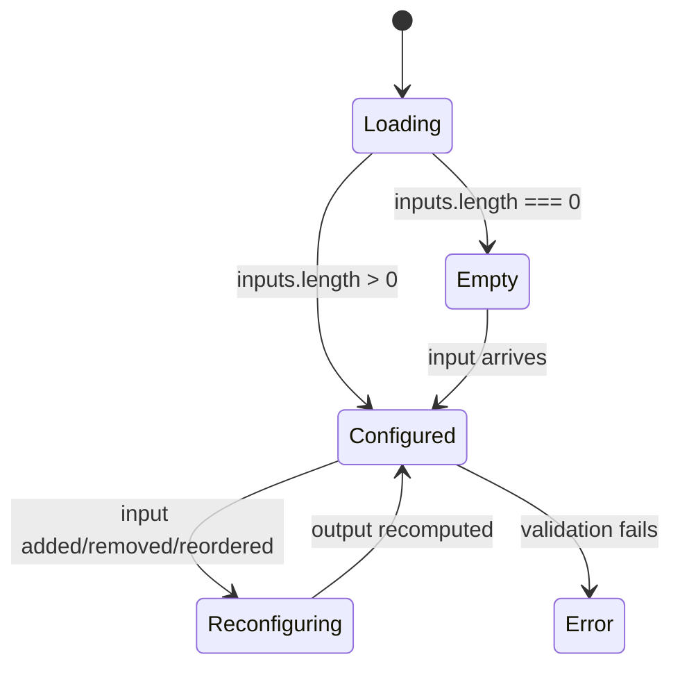

# Operator Contract: `[ComponentName]`

*Status: Draft | Review | Approved*
*Owner: [name]*
*Last updated: <date>*
*Related: [links to upstream specs, consuming view geometry contracts]*

> **What this document is.** A specification of the *operator function* that this surface performs — what typed configuration it produces and what downstream consumers it serves. If this document is doing its job, a redesign of visual chrome should not invalidate it; only a change to operator semantics, input/output contracts, or composition rules should.
>
> **What this document is not.** A geometry contract. A component spec. A design mockup. A style guide. Spatial projection semantics live in the consuming view's geometry contract, not here.

---

## 0. When to use this template

This template is for **operator surfaces** — components that produce typed configuration consumed by other views or pipelines, rather than projecting data onto spatial planes. An operator surface answers the question "what should downstream views do?" not "where should data appear?"

| Template | Use when | Example |
|----------|----------|---------|
| `geometry-contract-template.md` | The component owns a coordinate system, binds axes to PAFV planes, and projects data onto spatial coordinates | Time Explorer — projects temporal facets onto an x-plane via `scaleTime`, produces membership predicates from brush selections |
| `operator-contract-template.md` | The component produces typed configuration or transformation rules consumed by downstream views, with no spatial projection of its own | Chip Well — hosts draggable chip tokens organized into typed categories, publishes ordered DSL fragments to a compilation pipeline |

For components with spatial projection semantics, use the sibling [geometry contract template](geometry-contract-template.md) instead.

---

## 1. Intent

*One or two paragraphs of plain prose. What does this operator surface do? What typed configuration does it produce? What question is the user answering when they interact with it? What makes it architecturally distinct from a data view — why does it not project data onto spatial planes?*

[Component name] is the [purpose] surface. It produces [output type] consumed by [downstream consumers]. It is not a data view — it does not project data onto spatial planes or answer spatial questions. Its output is typed configuration that [what downstream does with it].

---

## 2. Operator surface

*This is the core of the contract: the operator's input/output contract and the explicit architectural boundary statement that distinguishes it from a geometry contract.*

### Input contract

*What typed inputs does this operator accept? What is the shape of each input (type signature, cardinality, ordering)? Reference the schema or type definitions. What must be true about the input for the operator to function?*

```ts
interface OperatorInput {
  // ...
}
```

### Output contract

*What typed output does this operator produce? What downstream consumers read this output? Is the output read-only from the consumer's perspective or bidirectional?*

```ts
interface OperatorOutput {
  // ...
}
```

### Why this is not geometric

*One or two sentences explaining why this component does not bind to PAFV planes or own a coordinate system. This is the architectural boundary statement — it signals to future readers that the absence of spatial semantics is deliberate, not an oversight. Reference FE-RG-13 if applicable.*

---

## 3. Data binding

*What runtime data does this operator surface bind to beyond its typed input contract? (If §2 fully describes the data flow, state "Covered in §2 — no additional data binding." Otherwise, describe supplementary data sources.)*

### Input contract

*Reference §2 if fully covered, or describe supplementary data sources here.*

```ts
interface DataBinding {
  // ...
}
```

### Cardinality expectations

*What are the expected input volumes? What processing strategy applies at each tier?*

| Regime | Cardinality | Processing strategy |
|--------|-------------|---------------------|
| Empty | 0 inputs | Empty state (see §6) |
| Sparse | 1–5 inputs | Single pass, no optimization needed |
| Typical | 5–20 inputs | Standard processing; wrapping or pagination may apply |
| Dense | 20+ inputs | Consider batching or pagination; evaluate perf contract |

### Aggregate handling

*Does this operator surface display or compute aggregates? If not, state "N/A — aggregates are produced downstream by [consumer]."*

---

## 4. Invariants

*The things that must always be true of this operator surface, regardless of data or user interaction. This is the section an implementation will violate first — be thorough.*

- *Example: "Every output item corresponds to exactly one user-configured input. No phantom outputs."*
- *Example: "Input order is user-controlled and semantically meaningful. The system never silently reorders."*
- *Example: "The operator is idempotent: applying the same configuration twice produces the same output."*
- ...

---

## 5. Degenerate and edge cases

*The cases where the naïve implementation breaks. Specify the expected behavior, not just that it "should handle it gracefully."*

| Case | Expected behavior |
|------|-------------------|
| Empty input | <empty state per §6> |
| Type-incompatible input | <reject? coerce? show coercion warning?> |
| Duplicate inputs | <deduplicate silently? surface warning? preserve order?> |
| Input referencing deleted or missing upstream artifact | <exclude? substitute placeholder? error state?> |
| Circular dependency among inputs | <detect and block? detect and warn? no detection?> |
| Maximum input cardinality exceeded | <hard limit? soft limit with warning? no limit?> |

---

## 6. States

### Reflow rules

*What happens when the container resizes? Does the operator surface reflow, collapse, or maintain its layout? Is the operator output stable across viewport changes?*

| Breakpoint | Behavior |
|------------|----------|
| <e.g., narrow panel> | <e.g., inputs scroll vertically, no layout reflow> |
| <e.g., wide panel> | <e.g., full layout with all input regions visible> |

### Lifecycle states

*State machine for the operator surface itself — not for individual inputs. Expressed as states with entry conditions and transitions.*



### Empty state

*What does the user see when there are no inputs? What action is offered?*

### Loading state

*What does the user see while inputs are being fetched or output is being computed? Skeleton? Spinner? Previous state?*

### Error state

*What does the user see when validation fails or input is invalid? How is this distinguished from empty?*

---

## 7. Interaction contracts

*Not "how does it feel to use" — that's prototyping territory. "What are the valid state transitions and what are their entry/exit conditions."*

### Gestures accepted

*Note: this operator surface uses pointer events exclusively. No HTML5 Drag and Drop API (`draggable`, `dragstart`, `drop`) — hard constraint from WKWebView (D-06). Verify if applicable.*

| Gesture | Target | Effect | Entry condition | Commit/abort |
|---------|--------|--------|-----------------|--------------|
| <e.g., drag item into operator surface> | <input region> | <adds item to operator input list> | <item must be type-compatible> | <drop inside region commits; drop outside aborts> |
| ... | ... | ... | ... | ... |

### Keyboard contract

*Focus order. Keyboard equivalents for every pointer gesture. Escape behavior.*

### Accessibility contract

*ARIA roles. Screen reader narration pattern. What does a blind user experience when the operator surface updates?*

---

## 8. Composition

*How does this operator surface participate in the larger app? What does it publish, what does it consume?*

### Upstream dependencies

*What upstream state does this operator consume? (e.g., available field list from SchemaProvider, card selection from StateCoordinator)*

### Downstream effects

*What downstream consumers read this operator's output? Who listens and what do they do with it? (e.g., compilation pipeline, consuming view's PAFV binding)*

### Coordination guarantees

*What coordination guarantees exist with sibling operators? When this operator and a sibling are active simultaneously, what synchronizes? What is allowed to diverge?*

---

## 9. Out of scope

*Explicit list of things this document does not specify. Prevents scope creep during review and protects the contract from absorbing concerns that belong elsewhere.*

- Visual styling (colors, typography, spacing, iconography) — see design tokens
- DSL grammar or compilation — see compilation pipeline spec
- Spatial projection of operator output — see consuming view's geometry contract
- Per-consumer-specific rules — see each consumer's spec
- Component-level props and internal state — see implementation spec
- ...

---

## 10. Open questions

*Unresolved decisions. Each should have an owner and a target resolution date, or be flagged as "deferred to <milestone>."*

- [ ] *<question>* — owner: <name>, target: <milestone or date>
- [ ] ...

---

## 11. Reference

### Visual calibration

*Link to one or two PNG stills showing canonical states. These are reference only — the contract above is authoritative when they disagree.*

- `<path/to/canonical-typical.png>` — typical-cardinality state
- `<path/to/canonical-empty.png>` — empty state

### Related contracts

*Other operator contracts this one shares patterns with, and geometry contracts that consume this operator's output (for contrast). For consistency, cross-reference sibling operator contracts; for contrast, cross-reference the geometry contracts that depend on this operator's output.*

- `geometry-contract-template.md` — relationship: sibling template (geometry contracts describe projection surfaces; this template describes operator surfaces)
- `<path/to/consuming-view-geometry.md>` — relationship: downstream (that view's geometry contract depends on this operator's output)
- `<path/to/sibling-operator-contract.md>` — relationship: sibling operator (same pattern, different domain)

### Changelog

*Material changes to the contract. Not every typo — decisions.*

| Date | Change | Rationale |
|------|--------|-----------|
| <YYYY-MM-DD> | Initial draft | — |
