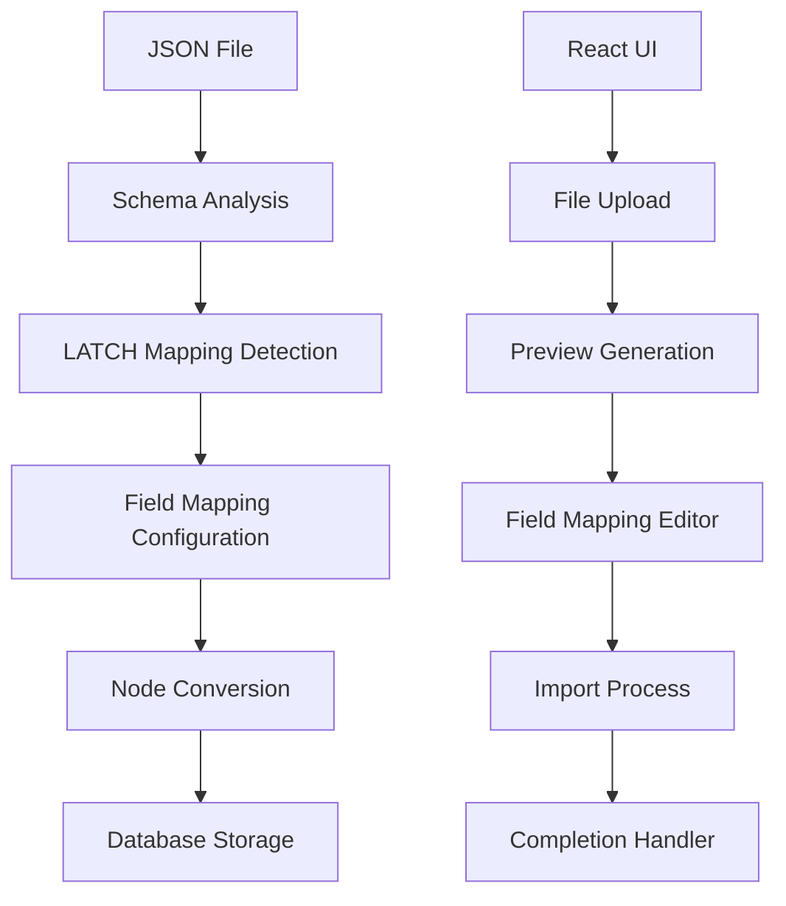

# JSON Import Pipeline Documentation

## Overview

The JSON Import Pipeline provides universal JSON data interchange capabilities for Isometry, enabling users to import structured data from JSON files with automatic schema inference and intelligent field mapping to the LATCH (Location, Alphabet, Time, Category, Hierarchy) framework.

## Architecture

### Core Components

1. **JSONImporter (Swift Actor)** - Native backend importer with schema inference
2. **JSONProcessor (TypeScript)** - React frontend processing utilities
3. **JSONImportWizard (React)** - User interface for guided import workflow
4. **Schema Inference Engine** - Automatic detection of data structure and LATCH properties

### Data Flow



## Features

### Schema Inference

- **Automatic Structure Detection**: Identifies object vs array structures
- **Property Analysis**: Determines data types, frequency, and nullability
- **LATCH Property Mapping**: Auto-detects Location, Alphabet, Time, Category, Hierarchy fields
- **Nested Object Handling**: Supports complex nested JSON structures
- **Large File Support**: Memory-efficient streaming for files up to 100MB

### React Import Wizard

- **4-Step Workflow**: Upload → Configure → Preview → Import
- **Live Preview**: Sample data display with inferred mappings
- **Interactive Field Mapping**: Drag-and-drop field assignment to LATCH properties
- **Batch Processing**: Multiple file import with individual configuration
- **Error Handling**: Graceful error recovery and user feedback

### Swift Backend Integration

- **Actor Pattern**: Thread-safe concurrent import processing
- **ImportResult Compatibility**: Standard result format with existing importers
- **Memory Management**: Streaming support for large datasets
- **GRDB Integration**: Direct database insertion with transaction safety

## Usage

### Basic Import (React)

```typescript
import { importJSONFile } from '../utils/jsonProcessor';

const file = new File([jsonContent], 'data.json');
const result = await importJSONFile(file, {
  nodeType: 'json-object',
  folder: 'imported-data',
  source: 'json-import'
});

console.log(`Imported ${result.nodes.length} nodes`);
```

### Custom Field Mapping

```typescript
const fieldMappings = [
  { jsonPath: 'user_name', targetProperty: 'name' },
  { jsonPath: 'bio', targetProperty: 'content' },
  { jsonPath: 'created_date', targetProperty: 'createdAt', transform: { type: 'date' } },
  { jsonPath: 'priority_level', targetProperty: 'priority', transform: { type: 'number' } }
];

const result = await importJSONFile(file, {
  fieldMappings,
  nodeType: 'person',
  folder: 'users'
});
```

### Using the Import Wizard

```typescript
import JSONImportWizard from './JSONImportWizard';

function App() {
  const [showImport, setShowImport] = useState(false);

  const handleImportComplete = (nodes) => {
    console.log(`Successfully imported ${nodes.length} nodes`);
    setShowImport(false);
  };

  return (
    <JSONImportWizard
      isOpen={showImport}
      onClose={() => setShowImport(false)}
      onImportComplete={handleImportComplete}
      folder="json-imports"
    />
  );
}
```

### Swift Backend Usage

```swift
let importer = JSONImporter(database: database)

do {
    let result = try await importer.importJSON(
        from: fileURL,
        folder: "imported-data"
    )

    print("Imported \(result.imported) nodes")

    if !result.errors.isEmpty {
        print("Errors: \(result.errors)")
    }
} catch {
    print("Import failed: \(error)")
}
```

## LATCH Property Detection

The system automatically detects and maps JSON fields to LATCH properties based on field names and content patterns:

### Location Properties
- **latitude**: Fields containing "lat" with numeric values
- **longitude**: Fields containing "lon", "lng" with numeric values
- **locationName**: Fields containing "location" with string values
- **locationAddress**: Fields containing "address" with string values

### Alphabet Properties (Content)
- **name**: Fields containing "name", "title"
- **content**: Fields containing "content", "body", "text", "description"
- **summary**: Fields containing "summary", "excerpt", "description"

### Time Properties
- **createdAt**: Fields containing "created", "date"
- **modifiedAt**: Fields containing "modified", "updated"
- **dueAt**: Fields containing "due"
- **completedAt**: Fields containing "completed"
- **eventStart**: Fields containing "start"
- **eventEnd**: Fields containing "end"

### Category Properties
- **folder**: Fields containing "folder", "directory", "group"
- **tags**: Fields containing "tag", "category"
- **status**: Fields containing "status", "state"
- **nodeType**: Fields containing "type"

### Hierarchy Properties
- **priority**: Fields containing "priority"
- **importance**: Fields containing "importance"
- **sortOrder**: Fields containing "order", "sort"

## Data Transformations

### Automatic Transformations
- **Date Fields**: ISO 8601 strings → Date objects
- **Numeric Fields**: String numbers → Number values
- **Boolean Fields**: String booleans → Boolean values
- **Array Fields**: CSV strings → Array values

### Custom Transformations

```typescript
const customTransform = {
  type: 'custom',
  customFunction: (value) => {
    // Custom transformation logic
    return transformedValue;
  }
};
```

## Supported JSON Structures

### Object Structure
```json
{
  "name": "Sample Item",
  "content": "Item description",
  "createdAt": "2024-01-01T10:00:00Z",
  "priority": 1,
  "tags": ["important", "work"]
}
```

### Array Structure
```json
[
  {
    "title": "First Item",
    "description": "First description"
  },
  {
    "title": "Second Item",
    "description": "Second description"
  }
]
```

### Nested Structure
```json
{
  "user": {
    "name": "John Doe",
    "profile": {
      "bio": "Software developer",
      "location": "San Francisco"
    }
  },
  "metadata": {
    "created": "2024-01-01T10:00:00Z",
    "tags": ["user", "profile"]
  }
}
```

### Primitive Array
```json
["apple", "banana", "cherry", "date"]
```

## Performance Considerations

### Memory Management
- **File Size Limits**: 100MB maximum for standard processing
- **Streaming Mode**: Automatic for large files
- **Batch Processing**: Configurable batch sizes (default: 100 items)

### Processing Optimization
- **Schema Caching**: Inferred schemas cached during preview
- **Lazy Loading**: Sample data loaded on demand
- **Background Processing**: Non-blocking import operations

## Error Handling

### Common Error Scenarios
1. **Invalid JSON**: Malformed JSON syntax
2. **File Access**: Permission or file not found errors
3. **Memory Limits**: Files exceeding 100MB limit
4. **Type Conversion**: Invalid data type conversions
5. **Database Errors**: Node creation failures

### Error Recovery
- **Graceful Degradation**: Continue processing valid items
- **Error Reporting**: Detailed error messages with context
- **Partial Imports**: Successfully imported nodes preserved on error

## Testing

### Unit Tests
- **Schema Inference**: 15+ test cases covering various JSON structures
- **Field Mapping**: Property detection and transformation tests
- **Error Handling**: Invalid input and edge case testing

### Integration Tests
- **React Component**: Full wizard workflow testing
- **User Interactions**: File upload, mapping configuration, import process
- **Error States**: Network errors, invalid files, permission issues

### Performance Tests
- **Large File Handling**: 100MB+ file processing
- **Memory Usage**: Memory leak detection and cleanup
- **Processing Speed**: Import performance benchmarks

## Security Considerations

### File Validation
- **Extension Check**: Only `.json` files accepted
- **Content Validation**: JSON syntax validation before processing
- **Size Limits**: 100MB maximum file size enforcement

### Data Sanitization
- **XSS Prevention**: HTML content escaped in generated markdown
- **SQL Injection**: Parameterized database queries
- **Path Traversal**: Secure file path handling

## Configuration

### Environment Variables
```bash
# Maximum file size (bytes)
MAX_JSON_FILE_SIZE=104857600

# Default batch size for streaming
DEFAULT_BATCH_SIZE=100

# Enable streaming mode threshold (bytes)
STREAMING_THRESHOLD=10485760
```

### Import Options
```typescript
interface JSONImportOptions {
  nodeType?: string;          // Default node type
  folder?: string;            // Target folder
  source?: string;            // Source identifier
  fieldMappings?: FieldMapping[];  // Custom mappings
  streamingMode?: boolean;    // Force streaming
  batchSize?: number;         // Items per batch
}
```

## Troubleshooting

### Common Issues

**Import fails with "Invalid JSON" error**
- Validate JSON syntax using online validator
- Check for unescaped quotes or trailing commas
- Ensure proper UTF-8 encoding

**Large files cause browser crashes**
- Enable streaming mode for files > 10MB
- Reduce batch size for memory-constrained environments
- Consider splitting large files into smaller chunks

**Field mappings not detected**
- Check field naming conventions match LATCH patterns
- Use custom field mappings for non-standard names
- Verify data types match expected values

**Import performance issues**
- Enable streaming mode for large datasets
- Adjust batch size based on available memory
- Process files individually rather than in bulk

### Debug Mode

Enable debug logging:
```typescript
const result = await importJSONFile(file, {
  ...options,
  debug: true  // Enables detailed logging
});
```

## Extending the Pipeline

### Custom LATCH Detection

```typescript
function customLATCHDetection(key: string, value: any): LATCHProperty | undefined {
  // Custom detection logic
  if (key.includes('custom_field')) {
    return 'customProperty';
  }
  return undefined;
}
```

### Custom Node Types

```typescript
const customOptions = {
  nodeType: 'custom-type',
  customTransforms: {
    'special_field': (value) => processSpecialValue(value)
  }
};
```

## Migration and Compatibility

### Version Compatibility
- **Swift**: iOS 15.0+, macOS 12.0+
- **React**: React 18+
- **TypeScript**: 4.5+
- **Node.js**: 16.0+ (for build tools)

### Data Migration
When upgrading from previous import systems:
1. Export existing data to JSON format
2. Use field mapping configuration to match old schema
3. Run test imports to verify data integrity
4. Perform full import with backup available

## Monitoring and Analytics

### Import Metrics
- **Success Rate**: Percentage of successful imports
- **Processing Time**: Average import duration
- **Error Frequency**: Common error patterns
- **File Size Distribution**: Import volume statistics

### Performance Monitoring
- **Memory Usage**: Peak memory consumption during import
- **CPU Utilization**: Processing resource consumption
- **Database Performance**: Node creation throughput

## Best Practices

### File Preparation
1. **Validate JSON** before import using external tools
2. **Optimize Structure** by flattening unnecessarily nested objects
3. **Standardize Field Names** to improve LATCH detection
4. **Include Metadata** like creation dates and source information

### Large Dataset Handling
1. **Split Large Files** into manageable chunks (< 50MB recommended)
2. **Use Streaming Mode** for files > 10MB
3. **Process in Batches** rather than all at once
4. **Monitor Memory Usage** during import operations

### Error Prevention
1. **Test with Sample Data** before full import
2. **Validate Field Mappings** using preview mode
3. **Backup Existing Data** before major imports
4. **Use Incremental Imports** for regular data updates

## Support and Contributing

### Documentation
- **API Reference**: Complete interface documentation
- **Examples**: Real-world usage examples
- **Tutorials**: Step-by-step import guides

### Contributing
1. **Code Style**: Follow existing TypeScript/Swift conventions
2. **Testing**: Add tests for new features
3. **Documentation**: Update docs for API changes
4. **Performance**: Consider impact on large datasets

### Getting Help
- **GitHub Issues**: Bug reports and feature requests
- **Discussions**: Implementation questions and best practices
- **Wiki**: Community-maintained examples and tips